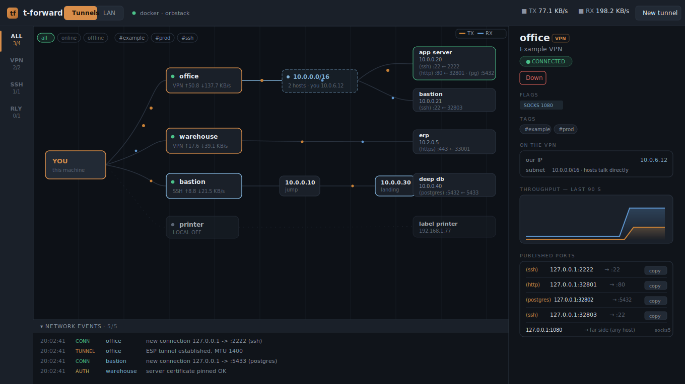
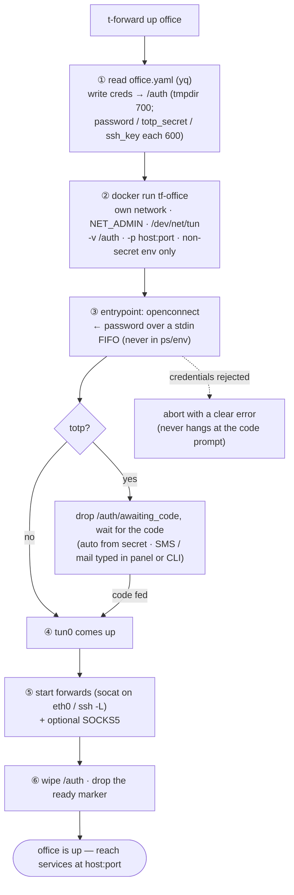
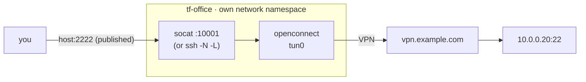

# t-forward

[](https://hub.docker.com/r/asimatasert/t-forward)
[](https://hub.docker.com/r/asimatasert/t-forward/tags)
[](https://github.com/Asimatasert/t-forward/releases)

**Docker-based tunnel & port-forward manager.** Define your VPNs / SSH jumps /
relays as small YAML files, bring them up with one command (each in its own
isolated container), and reach everything through stable `localhost` ports — with
an optional live web panel that maps your tunnels and even discovers your LAN.



<sub>The web panel's tunnel map (all data shown is synthetic).</sub>

One tool, three tunnel types:

| `type` | What runs in the container | Use it for |
|---|---|---|
| `vpn` | [openconnect](https://www.infradead.org/openconnect/) (fortinet / gp / anyconnect / …) | corporate & site VPNs, including out-of-band TOTP codes |
| `ssh` | `ssh -N` with `-L` forwards / `-D` SOCKS, optional multi-hop `ProxyJump` | anything behind a bastion / jump host |
| `local` | plain `socat` relays | pinning a LAN/remote service to a stable localhost port |

### Why one-container-per-tunnel

Every tunnel runs in its **own container on its own Docker network**, which buys
you, for free:

- **No route conflicts** — two VPNs pushing overlapping `10.x` subnets simply
  cannot collide; every tunnel lives in its own network namespace.
- **No cross-tunnel reachability** — one tunnel's container (and its remote side)
  can never reach another's. Listeners bind to the Docker side only, so nothing
  on the far side of a tunnel can reach them.
- **Host DNS untouched** — a VPN's DNS applies only inside its container (forward
  targets resolve through it), so Tailscale / mDNS / your resolver never break.
- **No sudo on the host** — openconnect gets root inside the container only.
- **Concurrent tunnels** — bring up as many as you like at once.

Access goes through **published port forwards** and an optional per-tunnel
**SOCKS5 proxy**, e.g. `ssh -p 2222 user@127.0.0.1` or
`curl --proxy socks5h://127.0.0.1:1080 http://10.0.0.20/`.

---

## Contents

- [Requirements](#requirements)
- [Install](#install)
- [Configure](#configure)
- [CLI usage](#cli-usage)
- [TOTP flow](#totp-flow-vpn)
- [Unattended / server mode](#unattended--server-mode)
- [Web panel](#web-panel)
- [Architecture](#architecture)
- [Security notes](#security-notes)
- [License](#license)

## Requirements

| Where | Dependency |
|---|---|
| Host | `bash` ≥ 3.2, `docker` (Docker Desktop / OrbStack / Linux dockerd), `yq` ([mikefarah](https://github.com/mikefarah/yq) v4 — reads the YAML configs) |
| Web panel (optional) | `go` ≥ 1.21 to build the daemon; `nmap` only for the LAN-discovery canvas |
| Container image (built for you) | Alpine + `openconnect` + `openssh-client` + `socat` + `microsocks` |

## Install

```sh
git clone https://github.com/Asimatasert/t-forward && cd t-forward
ln -s "$PWD/t-forward" /usr/local/bin/t-forward       # or anywhere on PATH
```

The container image is pulled automatically from
[Docker Hub](https://hub.docker.com/r/asimatasert/t-forward) (multi-arch:
amd64 + arm64) on first `up`. To build it locally instead, run
`./t-forward build` — or set `T_FORWARD_HUB_IMAGE=""` to always build.

## Configure

One YAML file per tunnel in `~/.config/t-forward/conf.d/` — the file name is the
tunnel name (`conf.d/office.yaml` → `t-forward up office`). Files are read with
`yq` (**never sourced**, so values need no shell quoting); mode `600` is enforced.
Fully-commented templates live in [`examples/`](examples/).

```yaml
# vpn
name: Example VPN
type: vpn                     # vpn | ssh | local
tags: [example]
vpn:
  server: vpn.example.com:10443
  protocol: fortinet          # fortinet | gp | anyconnect | nc | pulse | f5 | array
  user: username1
  password: ""                # omit -> prompted; a wrong servercert makes the log print the real pin
  totp: false                 # true -> code prompted after the password is sent
  totp_secret: ""             # optional base32 secret -> code generated automatically
socks: 1080                   # optional SOCKS5 port ("any" = random free port)
hosts:                        # forwards grouped by host, each self-describing
  - ip: 10.0.0.20
    name: app server          # shown in the panel; optional
    tags: [db, web]           # optional
    forwards:
      - { remote: 22,   local: 2222, service: ssh, user: root }
      - { remote: 5432, local: any }             # local port auto-picked; service auto-detected
      - { remote: 8080, local: 0.0.0.0:8080 }    # bind on the LAN, not just localhost
```

```yaml
# ssh — optionally multi-hop via ProxyJump
name: DB via bastion
type: ssh
ssh:
  host: 10.0.0.30             # the host you land on; forwards resolve from here
  user: username1
  key: ~/.ssh/id_ed25519      # key auth (required when `jump` is set); omit for a password prompt
  jump: [10.0.0.10]           # ordered hops before `host`: you -> 10.0.0.10 -> 10.0.0.30
hosts:
  - { ip: 10.0.0.40, name: db, forwards: [ { remote: 5432, local: 5433, service: postgres } ] }
```

```yaml
# local — no tunnel; use host.docker.internal for services on this machine
name: LAN printer
type: local
hosts:
  - { ip: 192.168.1.77, forwards: [ { remote: 9100, local: 9100 } ] }
```

**Fields.** `remote` is the server's port; `local` is your localhost port — a
number, `any` for an auto-picked free port, or `BIND:PORT` (e.g. `0.0.0.0:8080`
to expose on the LAN). `service` is auto-detected from the remote port when
omitted (22→ssh, 80→http, 5432→postgres, …); `user` feeds the panel's
ready-to-run copy string. Optional `subnets:` and per-device labels are used by
the web panel (below). Full schema: [`docs/CONFIG_NOTES.md`](docs/CONFIG_NOTES.md).

## CLI usage

```sh
t-forward                 # interactive menu
t-forward up office       # bring up (by file name, list index, or unique substring)
t-forward up office prod  # several tunnels at once
t-forward status          # active tunnels + their published ports
t-forward list            # every configured tunnel and its state
t-forward down office     # tear one down
t-forward down all        # tear everything down
t-forward logs -f office  # follow a tunnel's logs
```

Ad-hoc, without any config file:

```sh
t-forward up --server vpn.example.com --user username1 --protocol gp \
  --forward 2222:10.0.0.5:22 --socks any
t-forward up --ssh-host bastion.example.com --ssh-user username1 \
  --ssh-key ~/.ssh/id_ed25519 --forward 5433:10.0.0.20:5432
t-forward up --type local --name printer --forward 9100:192.168.1.77:9100
```

## TOTP flow (vpn)

For `totp: true` VPNs the password is sent automatically; the CLI then waits:

```
Verification code for 'office' (arrives via SMS / mail / Telegram): _
```

Type the code when it lands (usually 10–30 s later) and press Enter — the tunnel
comes up and forwards start. If `totp_secret` is set, openconnect generates the
code itself and no prompt appears. The web daemon can also inject codes without a
stored secret: `POST /totp/<name> {code}` (a phone shortcut / bot), or a
`totp_command:` in the conf whose stdout supplies the code.

A **rejected password fails fast** with a clear error instead of hanging on the
code prompt — so a wrong credential never masquerades as “still waiting”.

## Connecting to awkward gateways (vpn)

Two options smooth over real-world gateways:

- **`servercert:` empty / omitted** → the current certificate pin is probed once
  and trusted (trust-on-first-use). Survives a gateway rotating its cert without
  re-pinning by hand; pin it explicitly to close the first-connection MITM window
  (the log prints the exact pin to paste).
- **`no_dtls: true`** → tunnel over TLS only. Some gateways complete the DTLS
  (UDP) handshake but then black-hole the tunnel, stalling the connection; this
  skips UDP entirely.

## Unattended / server mode

`t-forward up office --restart` (or `restart: true` in the conf) sets the
container's restart policy to `unless-stopped`: the tunnel reconnects by itself
after a crash, a drop, or a host reboot, and published ports stay stable (`any`
ports are resolved to fixed free ports up front). Credentials are kept in the
private auth dir so the container can re-authenticate; `t-forward down` removes
them. Not allowed for manual-TOTP VPNs — unattended reconnection needs
`totp_secret` (or no TOTP).

## Web panel

An optional, self-contained Go daemon (`web/`, **stdlib only**) serves a live
control panel over Server-Sent Events. It drives this same CLI and reads Docker
state — no database, no framework.

```sh
cd web && go build -o t-forward-web .
TF_WEB_TOKEN=$(openssl rand -hex 24) ./t-forward-web --addr 127.0.0.1:8787
# open http://127.0.0.1:8787/?token=<the token above>
```

Flags: `--addr` (bind address), `--token-file <path>` (read the token from a
file), `--config-dir`, `--tf <path to CLI>`, `--no-auth` (disable the token
check — only on a trusted private bind). The token may also come from the
`TF_WEB_TOKEN` env var; if none is given a random one is printed at startup.

The panel has **two canvases**, switched from the top bar:

**Tunnels** — a live topology map, `YOU → container → target hosts`, with:
- real packet-flow particles driven by per-tunnel throughput (`docker stats`),
  and a rolling TX/RX chart;
- **pan & zoom** (drag empty space or scroll to zoom toward the cursor; `−/%/fit`
  controls) and **draggable boxes** to hand-arrange the map — the arrangement is
  saved **server-side**, so it looks the same on every machine; a **lock** guards
  against accidental moves and a **reset** restores the auto layout;
- **per-port reachability dots** (green reachable / red blocked / grey unknown)
  next to every forward — so a host the gateway lets you reach on one port but
  firewalls on another reads at a glance;
- a filterable, level-tagged **network-event console** (connections, tunnel,
  auth, errors);
- click any node to inspect it — copy ready-made connection strings
  (`ssh -p … user@host`, `psql …`, `redis-cli …`), open http/vnc/rdp URIs,
  edit names/tags/notes inline (written safely back to the YAML);
- **virtual subnet nodes** for the network each host sits behind, **jump-chain
  nodes** for multi-hop ssh, and **cross-tunnel jumps**: an ssh tunnel that rides
  another tunnel's forward folds into it as one continuous `host → subnet →
  jumped host` chain, to any depth;
- a 🔑 marker on TOTP tunnels; up / down / retry / TOTP-code actions, tag &
  online/offline filters.

**LAN** — network discovery. Point [`scan.yaml`](examples/scan.example.yaml) at
one or more interfaces and the daemon uses `nmap` to map reachable devices and
their open ports, on an interval, cached (memory + a JSON file, optionally
Redis via `redis-cli`). Features:
- root scan (ARP + SYN, fast, resolves MACs) when a `NOPASSWD` sudoers entry for
  nmap exists, otherwise an unprivileged connect-scan — no root required;
- text + port filters; scan events in the console;
- per-device **name/tags**, keyed by a stable identity (MAC when known, else IP),
  persisted and re-applied on every scan;
- one-click **forward** of any discovered open port to localhost (spins up an
  `any`-port `local` relay), per-port or all-at-once;
- per-adapter rescan that updates one interface in place.

## Architecture

Two planes. A **control plane** — the `t-forward` bash CLI (and the optional Go
web daemon) — that only ever talks to Docker and `yq`; and a **data plane** —
one container per tunnel — that holds the actual tunnel and the forwards. The
control plane keeps no state of its own: **state _is_ Docker**.

### Connection flow

What `t-forward up office` actually does, start to finish:



`down` is just `docker rm -f tf-office` — the network namespace (routes, `tun0`,
listeners) dies with the container, so there is nothing to unwind.

### The data path

Each tunnel is one container (`tf-<name>`) on its own Docker network. Inside it,
the tunnel comes up and a small relay publishes each service on a host port:



- **vpn** — `openconnect` (fortinet/gp/anyconnect/…) on `tun0`; `socat` listeners
  forward each `host:port → tun0 → remote`.
- **ssh** — `ssh -N` with native `-L` forwards / `-D` SOCKS, optionally through a
  multi-hop `ProxyJump` chain.
- **local** — no tunnel; plain `socat` relays (pin a LAN/remote host:port to a
  stable local port).

Listeners bind the container's `eth0` (the Docker-published side) **only**, so
nothing on the far side of a tunnel can reach a forward or the SOCKS proxy. The
host port is `127.0.0.1` by default, or `T_FORWARD_BIND` (e.g. a Tailscale IP)
to share forwards on a trusted network.

### The auth bridge

Credentials never sit on the host command line or in the container's env. `up`
writes them into a private `700` tmpdir mounted at `/auth` (`password`,
`totp_secret`, or an `ssh_key`, each `600`). The entrypoint feeds the password to
openconnect over a stdin **FIFO** (so it never appears in `ps`), handles the TOTP
code (auto from a secret, or waits for the host to drop `/auth/code`), then —
once the tunnel is up — **wipes `/auth`** and drops a `ready` marker the CLI
waits on. Only non-secret operands (`VPN_SERVER`, `VPN_USER`, the public
`SERVERCERT` pin, `FORWARDS`, …) are passed as env.

### State = Docker

There is no database and no daemon-of-record. A tunnel’s existence, status and
metadata live in the `tf-<name>` container and its labels, so `status`, `logs`
and `down` are thin wrappers over `docker ps` / `logs` / `rm -f`, and a crash or
reboot leaves nothing to reconcile. `up --restart` sets `unless-stopped` so the
container reconnects itself.

### The web daemon (optional)

A dependency-free Go binary (`web/`) that **reconciles**, never owns: it reads
the same YAML (via `yq -o=json`, never sourcing it) and live `docker ps/stats/
logs`, streams them to the panel over SSE (with a `/state` + `/evlog` polling
fallback for proxies that buffer SSE), and turns panel clicks into the same CLI
verbs. Config edits go through `yq -i` with values passed **only** as environment
variables — so a crafted value can't inject yq/shell syntax — and never touch the
credential keys. It binds loopback with a token by default; `--no-auth` is for a
trusted private bind (e.g. a tailnet IP), still behind a Host-header /
cross-site / JSON-only guard.

## Security notes

- The web daemon is meant to bind a **trusted address** (localhost, or a private
  overlay like a Tailscale IP) and is protected by a bearer token; it has **no
  TLS** and the token can appear in a URL, so never expose it on a public
  interface or behind a logging proxy. `--no-auth` removes the token entirely —
  only use it on a private bind where everyone who can reach it is trusted.
- Configs hold plaintext credentials; they are kept at mode `600` and the
  `.gitignore` excludes real config directories. Keep them out of version control.
- Panel config edits are whitelisted and injection-safe, and never modify the
  password / servercert / totp_secret / ssh key.

## License

[MIT](LICENSE)
